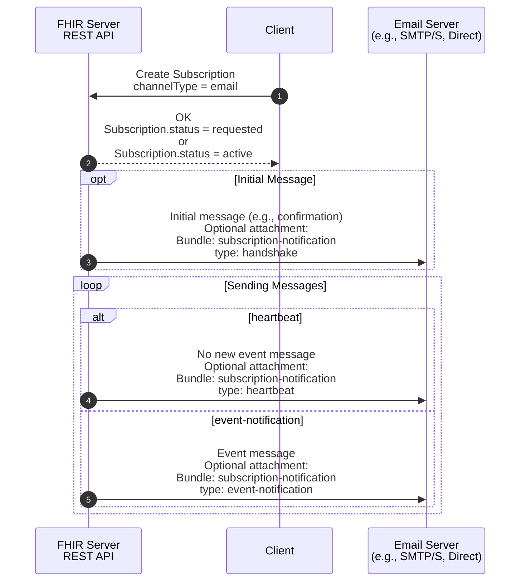
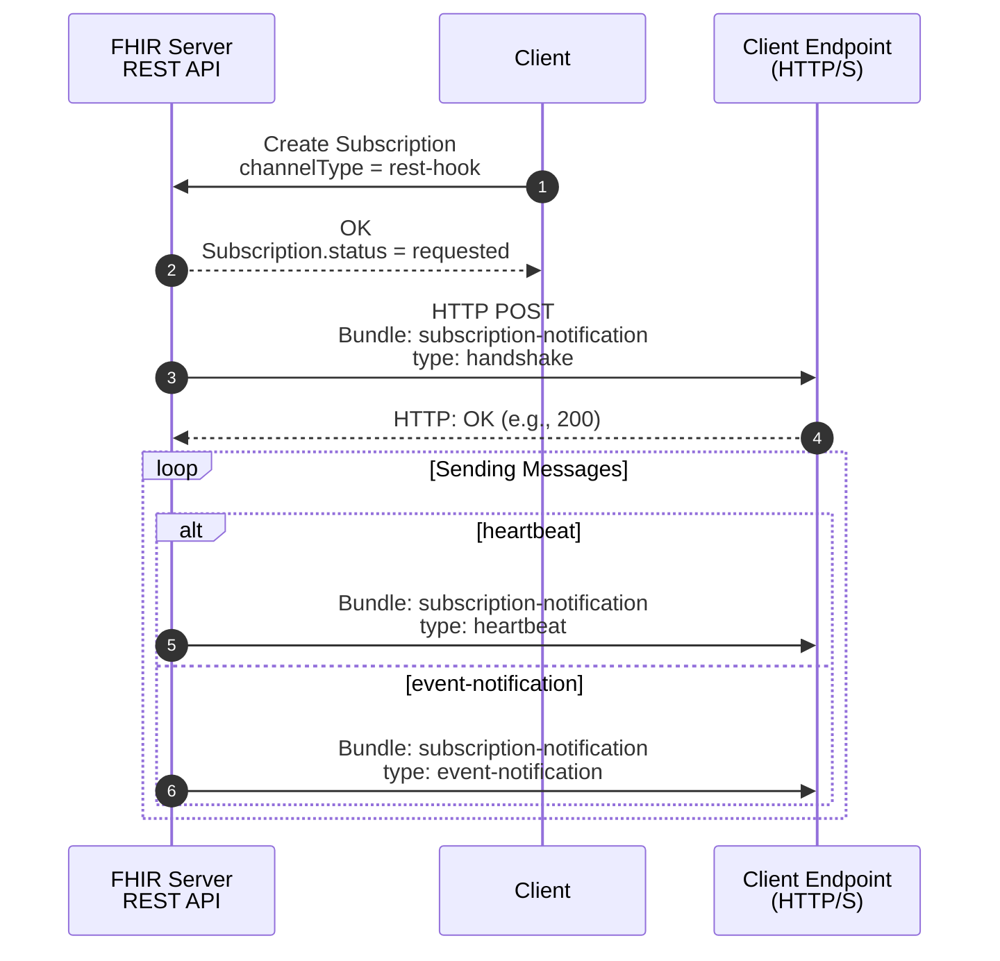
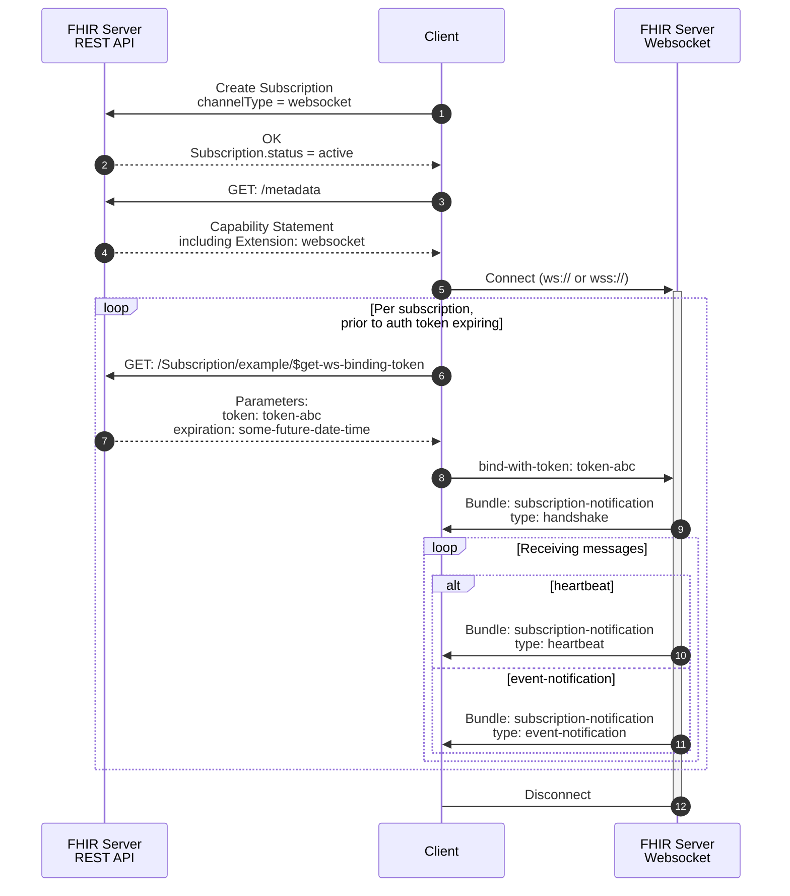
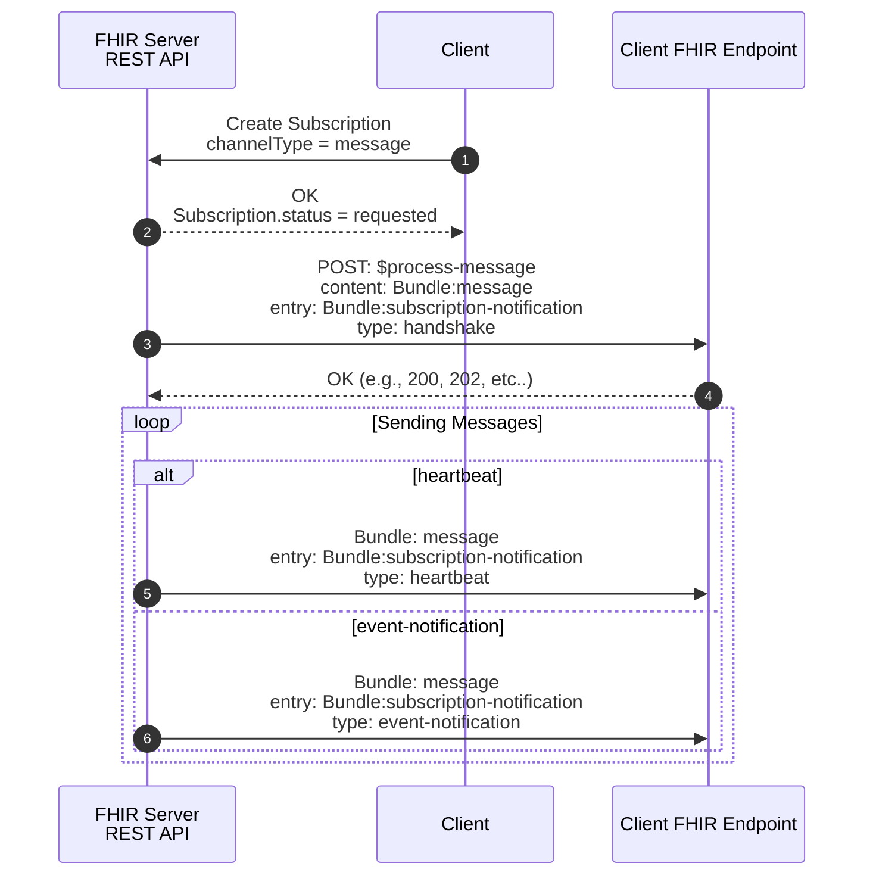

# subscription-email-flow.svg

```mermaid
sequenceDiagram
  autonumber
  participant S as FHIR Server<br/>REST API
  participant C as Client
  participant E as Email Server<br/>(e.g., SMTP/S, Direct)
  C->>S: Create Subscription<br/>channelType = email
  S-->>C: OK<br/>Subscription.status = requested<br/>or<br/>Subscription.status = active
  opt Initial Message
    S->>E: Initial message (e.g., confirmation)<br/>Optional attachment:<br/>Bundle: subscription-notification<br/>type: handshake
  end
  loop Sending Messages
    alt heartbeat
      S->>E: No new event message<br/>Optional attachment:<br/>Bundle: subscription-notification<br/>type: heartbeat
    else event-notification
      S->>E: Event message<br/>Optional attachment:<br/>Bundle: subscription-notification<br/>type: event-notification
    end
  end
```

# subscription-rest-hook-flow.svg

```mermaid
sequenceDiagram
  autonumber
  participant S as FHIR Server<br/>REST API
  participant C as Client
  participant E as Client Endpoint<br/>(HTTP/S)
  C->>S: Create Subscription<br/>channelType = rest-hook
  S-->>C: OK<br/>Subscription.status = requested
  S->>E: HTTP POST<br/>Bundle: subscription-notification<br/>type: handshake
  E-->>S: HTTP: OK (e.g., 200)
  loop Sending Messages
    alt heartbeat
      S->>E: Bundle: subscription-notification<br/>type: heartbeat
    else event-notification
      S->>E: Bundle: subscription-notification<br/>type: event-notification
    end
  end
```

# subscription-websocket-flow.svg

```mermaid
sequenceDiagram
  autonumber
  participant S as FHIR Server<br/>REST API
  participant C as Client
  participant E as FHIR Server<br/>Websocket
  C->>S: Create Subscription<br/>channelType = websocket
  S-->>C: OK<br/>Subscription.status = active
  C->>S: GET: /metadata
  S-->>C: Capability Statement<br/>including Extension: websocket
  C->>+E: Connect (ws:// or wss://)
  loop Per subscription,<br/>prior to auth token expiring
    C->>S: GET: /Subscription/example/$get-ws-binding-token
    S-->>C: Parameters:<br/>token: token-abc<br/>expiration: some-future-date-time 
    C->>E: bind-with-token: token-abc
    E->>C: Bundle: subscription-notification<br/>type: handshake
    loop Receiving messages
      alt heartbeat
        E->>C: Bundle: subscription-notification<br/>type: heartbeat
      else event-notification
        E->>C: Bundle: subscription-notification<br/>type: event-notification
      end
    end
  end
  E->-C: Disconnect
```

# subscription-messaging-flow.svg

```mermaid
sequenceDiagram
  autonumber
  participant S as FHIR Server<br/>REST API
  participant C as Client
  participant E as Client FHIR Endpoint
  C->>S: Create Subscription<br/>channelType = message
  S-->>C: OK<br/>Subscription.status = requested
  S->>E: POST: $process-message<br/>content: Bundle:message<br/>entry: Bundle:subscription-notification<br/>type: handshake
  E-->>S: OK (e.g., 200, 202, etc..)
  loop Sending Messages
    alt heartbeat
      S->>E: Bundle: message<br/>entry: Bundle:subscription-notification<br/>type: heartbeat
    else event-notification
      S->>E: Bundle: message<br/>entry: Bundle:subscription-notification<br/>type: event-notification
    end
  end
```