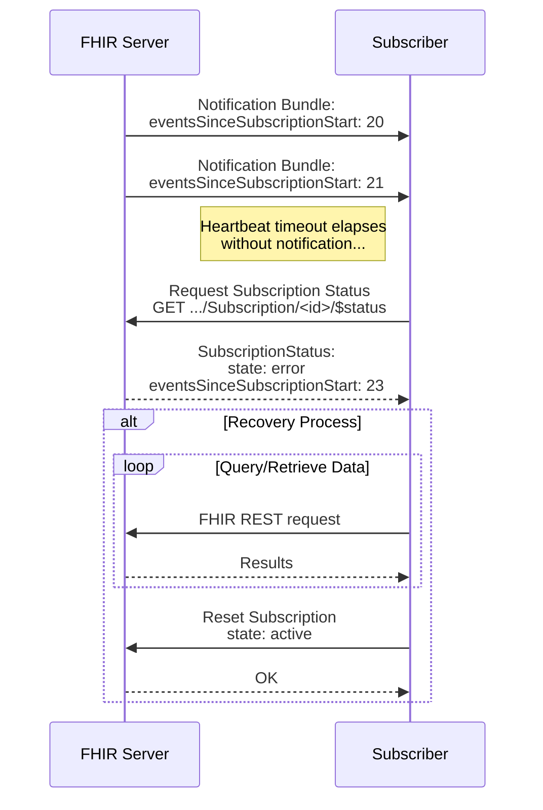
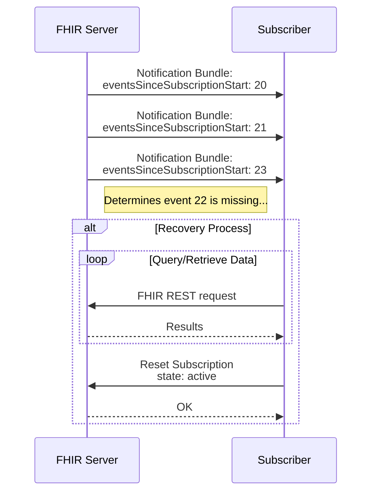

# subscriptions-no-event.svg

```mermaid
sequenceDiagram
  participant S as FHIR Server
  participant E as Subscriber
  S->>E: Notification Bundle:<br/>eventsSinceSubscriptionStart: 20
  S->>E: Notification Bundle:<br/>eventsSinceSubscriptionStart: 21

  Note left of E: Heartbeat timeout elapses<br/>without notification...

  E->>S: Request Subscription Status<br/>GET .../Subscription/<id>/$status
  S-->>E: SubscriptionStatus:<br/>state: error<br/>eventsSinceSubscriptionStart: 23

  alt Recovery Process
    loop Query/Retrieve Data
      E->>S: FHIR REST request
      S-->>E: Results
    end
    E->>S: Reset Subscription<br/>state: active
    S-->>E: OK
  end
```

# subscriptions-skipped-event.svg

```mermaid
sequenceDiagram
  participant S as FHIR Server
  participant E as Subscriber
  S->>E: Notification Bundle:<br/>eventsSinceSubscriptionStart: 20
  S->>E: Notification Bundle:<br/>eventsSinceSubscriptionStart: 21
  S->>E: Notification Bundle:<br/>eventsSinceSubscriptionStart: 23

  Note left of E: Determines event 22 is missing...

  alt Recovery Process
    loop Query/Retrieve Data
      E->>S: FHIR REST request
      S-->>E: Results
    end
    E->>S: Reset Subscription<br/>state: active
    S-->>E: OK
  end
```
